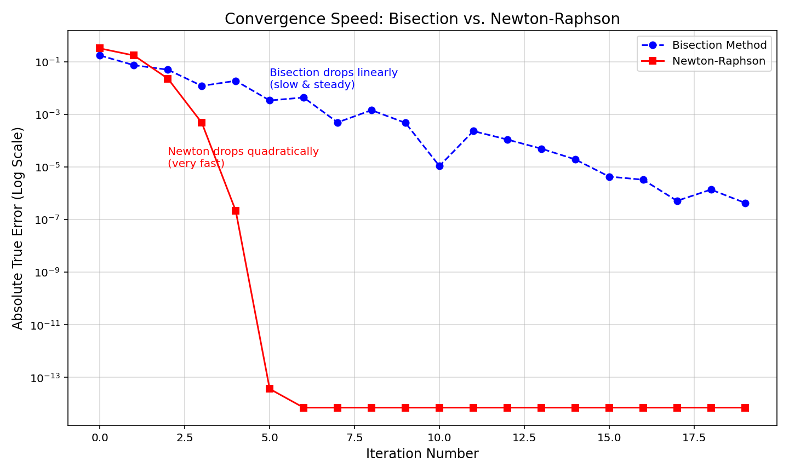

# Root Finding Algorithms

This folder contains Python implementations of numerical methods for finding the roots of non-linear equations ($f(x) = 0$). These algorithms are fundamental in engineering for solving equilibrium problems, circuit design, and structural analysis.

## 📂 Files in this Module

| File | Method Type | Description |
| :--- | :--- | :--- |
| **`bisection_method.py`** | Bracketing | A robust, "closed" method that iteratively narrows down an interval $[x_l, x_u]$ containing the root. Guaranteed to converge if the sign changes over the interval. |
| **`newton_raphson.py`** | Open | Uses the function's derivative $f'(x)$ to linearly approximate the root. Converges quadratically (extremely fast) but requires a good initial guess. |
| **`beam_deflection_bisection.py`** | **Application** | An engineering use-case applying the Bisection method to solve for critical points in a structural beam deflection equation. |
| **`convergence_comparison.py`** | Analysis | A script that runs both methods side-by-side to visualize and compare their convergence speeds (see plot below). |

## 📊 Performance Analysis: Newton-Raphson vs. Bisection

I created a comparison script to analyze the efficiency of Bracketing vs. Open methods.

* **Bisection** reduces the error linearly (slow, steady, reliable).
* **Newton-Raphson** reduces the error quadratically (the number of significant digits roughly doubles with every iteration).


*(Generated using `convergence_comparison.py`)*

## 🛠 Usage

To run the convergence comparison and generate the plot:

```bash
python convergence_comparison.py